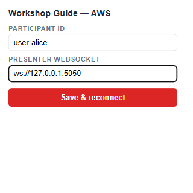
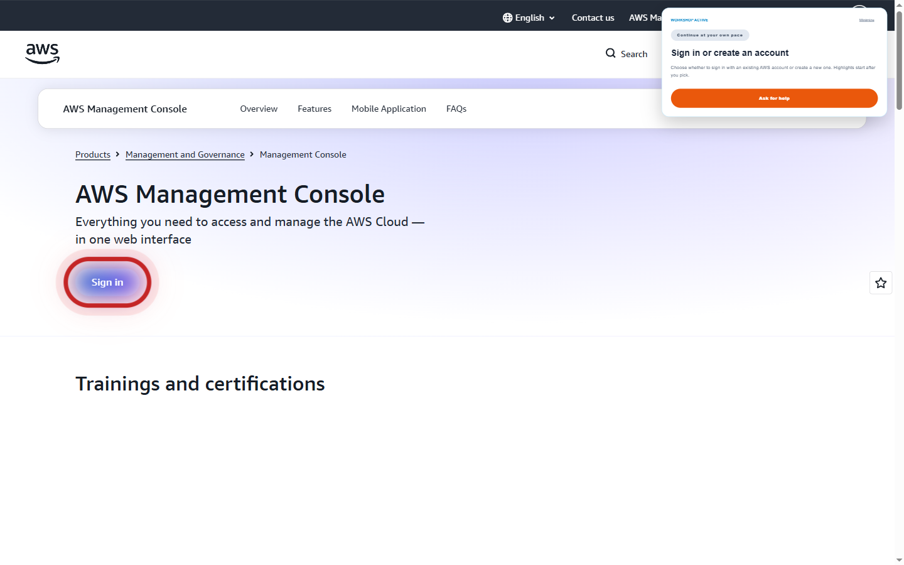
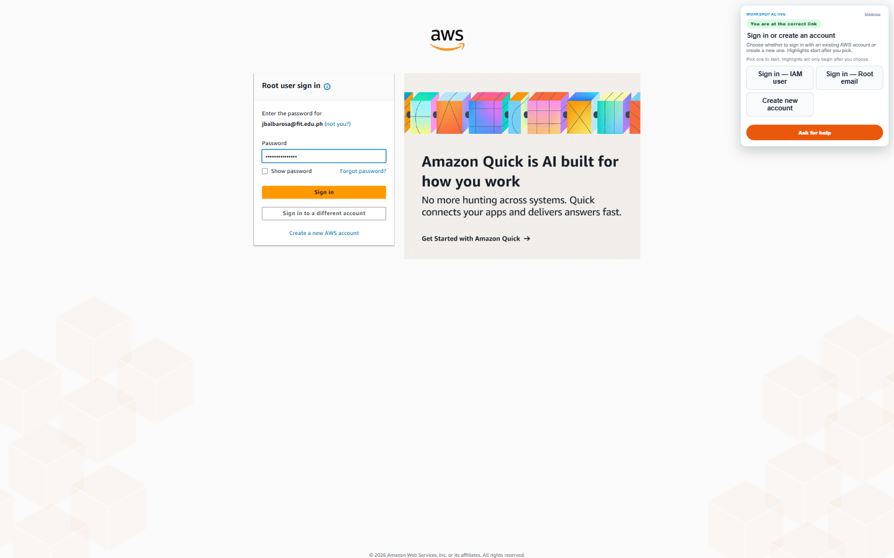
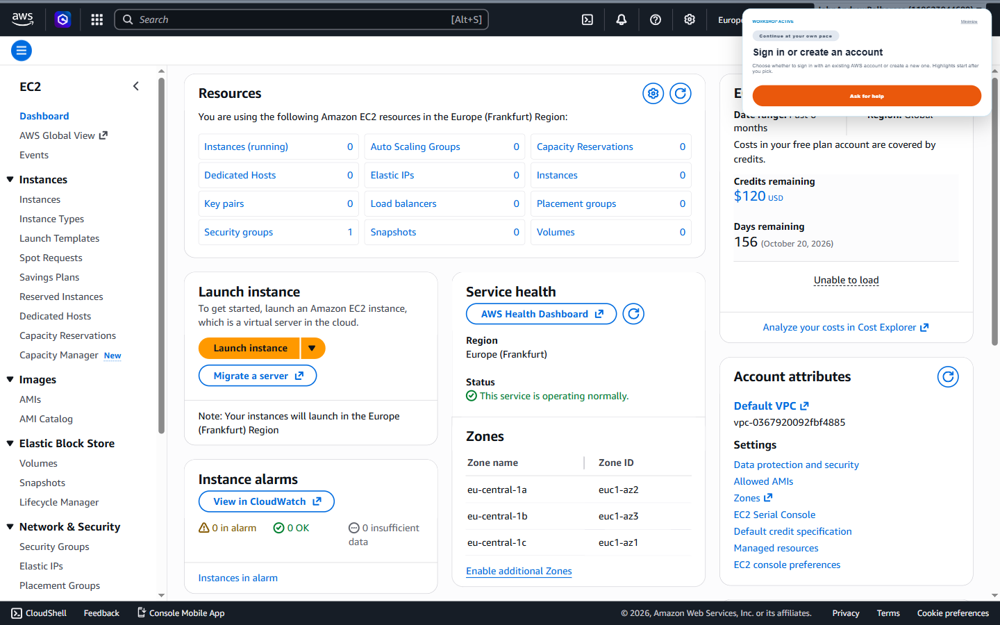

# Getting Started — Legarda Workshop 3

Beginner guide para sa first-time users ng AWS EC2 workshop platform na 'to. Kung dev ka at gusto mo yung architectural details, tingnan mo na lang ang [`README.md`](./README.md).

---

## Ano ba 'to?

Local-first na coordination tool para sa workshop kung saan may **presenter** (yung nagtuturo), **users** (yung mga participants), at **ushers** (yung tumutulong sa stuck na participants). Lahat ng devices nasa same WiFi — walang internet needed para mag-sync.

- **Presenter** controls the pacing (Next Step / Previous Step).
- **Users** automatically follow along — ipapakita sa screen nila yung current step at mag-highlight ng tamang AWS Console buttons via Playwright.
- **Ushers** monitor the help queue — pag may umangat na "Request Help", makikita nila yung seat number at sino ang stuck.

---

## Bago magsimula

Kelangan mo:

- **Node.js 18 or newer** — check via `node --version`.
- **npm** — kasama na 'to sa Node install.
- **Same WiFi network** para sa lahat ng devices (presenter laptop + participant laptops + usher device).
- **Modern browser** — Chrome / Edge / Firefox. Playwright will install its own Chromium for the AWS overlay automation.

Para mahanap yung IP address mo sa Windows:

```powershell
ipconfig
```

Hanapin yung "IPv4 Address" sa active WiFi adapter — yan yung `PRESENTER_IP` na gagamitin sa baba (halimbawa: `192.168.1.42`).

---

## Yung Tatlong Roles

| Role | URL na bubuksan | Anong ginagawa |
|------|----------------|----------------|
| **Presenter** | `http://PRESENTER_IP:5050/presenter` | Step controls, room progress, help queue overview |
| **User** | `http://127.0.0.1:5174/user?id=user-1&seat=A1` | Sumusunod sa step, may "Request Help" button |
| **Usher** | `http://PRESENTER_IP:5050/usher?id=usher-1` | Help queue + sino ang stuck sa anong step |

> Yung **Usher** dashboard walang setup — link lang. Buksan mo lang sa any browser na pwedeng umabot sa presenter IP.

---

## Quick Start (single machine, for testing)

Gusto mo lang subukan kung paano gumagana? Tatlong terminal, isang machine:

```powershell
# 1. Install deps (one-time, per role folder)
cd presenter; npm install; cd ..
cd user;      npm install; cd ..

# 2. Start the presenter server (Terminal 1)
npm run start:presenter
# → "Presenter server listening on http://10.250.250.1:5050"
```

Pag ayaw mag-bind sa `10.250.250.1`, override mo yung host:

```powershell
$env:PRESENTER_HOST = "127.0.0.1"
npm run start:presenter
```

Tapos buksan mo sa browser:

- `http://127.0.0.1:5050/presenter`
- `http://127.0.0.1:5050/user?id=demo&seat=A1`
- `http://127.0.0.1:5050/usher?id=usher-1`

Ito yung mga screen na makikita mo:

### Presenter Dashboard


Dito mo i-cocontrol yung workshop. Yung "Next Step" button ang magpapasulong ng buong room. Sa baba makikita mo lahat ng participants at sino ang need ng tulong.

### User Workspace


Ito ang makikita ng bawat participant. May current step, target AWS URL button, at "Request Help" pag stuck.

### Usher Dashboard


Pag may nag-click ng "Request Help", lalabas siya dito agad with seat number — para alam ng usher kung saang upuan pupunta.

---

## Multi-Device Setup (real workshop)

Eto na yung totoong setup — separate machines per role.

### 1. Sa Presenter Machine

```powershell
cd presenter
npm install
$env:PRESENTER_HOST = "<YOUR_LAN_IP>"   # e.g. 192.168.1.42
npm start
```

Tandaan yung IP — i-share mo sa mga participants at sa usher.

Buksan: `http://<YOUR_LAN_IP>:5050/presenter`

### 2. Sa Bawat Participant Laptop

**Recommended:** gamitin yung Chrome extension (tingnan yung [Chrome Extension — Workshop Guide](#chrome-extension--workshop-guide) section sa baba). Mas simple, walang Playwright install, tumatakbo sa real Chrome ng participant.

Kung gusto mo yung legacy Playwright-based user panel (web UI sa `127.0.0.1:5174`):

```powershell
cd user
npm install
npm run setup:playwright            # one-time, installs Chromium for the AWS overlay
$env:PRESENTER_WS = "ws://<PRESENTER_IP>:5050"
npm start
```

Buksan sa browser: `http://127.0.0.1:5174/user?id=user-1&seat=A1`

Palitan yung `id` at `seat` per participant (e.g. `user-2&seat=A2`, `user-3&seat=B1`, ...). Yung seat label ito yung makikita ng usher pag nag-request ng help.

Para sa AWS Console overlay sa legacy path:

```powershell
$env:PRESENTER_WS = "ws://<PRESENTER_IP>:5050"
npm run start:aws-guide
```

### 3. Sa Usher Device

Walang install. Buksan lang sa any browser:

```
http://<PRESENTER_IP>:5050/usher?id=usher-1
```

Pwede kang maglagay ng multiple usher (`usher-2`, `usher-3`, ...) — same URL pero iba yung `id`.

---

## Chrome Extension — Workshop Guide

Pinakapadaling paraan para makuha yung in-page AWS highlights ay sa pamamagitan ng **Workshop Guide Chrome extension** (nasa `extension/` folder). Tumatakbo siya sa real Chrome ng participant — walang Playwright, walang headful browser. Yung extension nag-attach ng red ripple highlight sa tamang AWS button per step, may overlay panel na may step instructions, at may "Ask for help" button.

### Install ng extension (one-time per participant device)

1. Buksan sa Chrome ang URL: `chrome://extensions`
2. Sa top-right, i-toggle ang **Developer mode**.
3. Click **Load unpacked**.
4. Hanapin yung `extension/` folder ng repo na 'to (e.g. `Desktop\Legarda Workshop 3\extension`) at i-select.
5. May lalabas na extension card — "Workshop Guide — AWS". Pin mo sa toolbar para madali makita.

Optional shortcut: gamitin yung existing PowerShell script — magbubukas ng fresh Chrome window na may extension na naka-load (separate profile, walang konflikt sa main Chrome mo):

```powershell
.\start-extension.ps1
```

### Configure yung extension

I-click yung extension icon sa toolbar para mag-open yung popup. Lagyan ng Participant ID at Presenter WebSocket URL, tapos click **Save & reconnect**.



- **Participant ID** — kahit anong unique name (e.g. `user-1`, `juan-a1`). Ito yung makikita ng presenter at usher.
- **Presenter WebSocket** — `ws://<PRESENTER_IP>:5050` (palitan ang `<PRESENTER_IP>` ng actual IP ng presenter machine). Para sa single-machine test, `ws://127.0.0.1:5050`.

### Sa AWS Home page

Pagpunta mo sa `https://aws.amazon.com/console/`, lalabas yung overlay panel sa top-right at mag-aapply ng red ripple sa "Sign in" hero button:



Yung "WORKSHOP ACTIVE" badge means connected na yung extension sa presenter WS. Yung step title at description galing sa current step ng presenter. May "Ask for help" button — pag-click, ire-route sa usher dashboard with your participant ID.

### Pagkatapos mag-sign in — Console Home

After mong i-sign-in (kasama yung MFA from phone), pupunta ka sa AWS Console Home. Yung extension automatic mag-highlight ng search bar para mahanap mo yung EC2:



Yan yung red ripple sa top search bar. Type mo lang "EC2" at i-click yung resulta para pumunta sa EC2 service.

### EC2 Dashboard

Pagdating sa EC2 dashboard, automatic mag-highlight yung "Launch instance" CTA:



Yung overlay panel sa top-right palagi visible — pwede mong i-minimize via "Minimize" link kung nakaharang sa AWS UI.

### Pag nawalan ng connection

Kung nawala connection sa presenter (e.g. wala ka sa same WiFi, o nag-iba IP ng presenter), magkakaroon ng modal sa loob ng AWS page na hihingin yung tamang Presenter IP. I-type mo lang at click Reconnect — port 5050 automatic.

### I-regenerate yung extension screenshots

May script na — boots presenter server, loads extension sa Playwright Chromium, gagawa ng captures. Kailangan mo lang mag-sign-in manually pag may pause prompt:

```powershell
npm run screenshots:extension
```

Yung profile ginagamit nito throwaway — bawat run gumagawa ng bagong temp folder sa `%TEMP%`, tapos automatic na inaalis pagkatapos. Walang naiwang credentials sa disk.

---

## Typical Workshop Flow

1. Pre-workshop: presenter pinapatakbo na yung server. Participants nakapasok na sa user URL nila with seat assigned. Usher bukas na yung dashboard.
2. Presenter clicks **Next Step** → lahat ng users auto-advance sa next step simultaneously. Yung AWS Console nila (kung naka-`start:aws-guide`) automatic mag-highlight ng tamang button.
3. Participant na stuck → click "Request Help" sa kanilang user panel.
4. Usher's dashboard agad nagpapakita ng seat number at kung anong step yung stuck — pumupunta sila sa upuan na yun.
5. Pag resolved, usher clicks "Mark Resolved" → mawawala sa queue, ma-log para sa post-workshop report.
6. After workshop, presenter clicks **Export Report** → makakakuha ka ng `report.txt` na may completion stats per participant.

---

## Troubleshooting

**"Cannot connect to WS" sa user panel.**
Make sure yung `PRESENTER_WS` env var ay tama at kapareho yung IP ng `ipconfig` ng presenter. Same WiFi ba kayo? Firewall blocking port 5050?

**"EADDRINUSE: port 5050 already in use".**
May ibang process na hawak yung port. Sa Windows, patayin sa Task Manager o:

```powershell
Get-NetTCPConnection -LocalPort 5050 | Select-Object OwningProcess
Stop-Process -Id <process_id> -Force
```

**Playwright session lock error sa user side.**
Existing reset script na para dito — patakbuhin mo lang:

```powershell
.\start.ps1
```

Mag-kikill yung lahat ng related node processes, lilinis ng `user/.aws-session/SingletonLock`, at i-restart yung services with auto-detected LAN IP.

**Extension overlay hindi lumalabas sa AWS page.**
Check yung extension popup — kompleto ba ang Participant ID at Presenter WS URL? Make sure naka-pin ang extension at active. I-reload yung AWS page. Kung kakatapos lang mag-load unpacked, minsan kailangan i-toggle off-on yung extension sa `chrome://extensions`.

**Extension nagprompt ng "Presenter not found" modal.**
Lost connection sa presenter — i-type ang tamang IP sa input field at click Reconnect. Or update sa popup at click Save & reconnect.

**Red ripple hindi lumalabas pero overlay panel ay visible.**
Yung URL ng AWS page mo possibly walang naka-define na profile sa `highlight-engine.js` para sa current step. Normal pag transitional pages (e.g. signin redirects). Bumalik sa expected step URL.

**Gusto kong i-regenerate yung screenshots sa docs.**

Dashboards (presenter/user/usher):

```powershell
npm run screenshots
```

Extension walkthrough (kailangan mo manually mag-sign-in sa AWS pag may pause prompt):

```powershell
npm run screenshots:extension
```

Yung extension version magbubukas ng visible Chromium window, lo-load yung `extension/` folder, mag-co-configure ng popup, at maghihintay ng manual AWS sign-in mo (with MFA from phone). Pagkatapos magsi-screenshot ng Console Home + EC2 Dashboard with overlay. Yung throwaway Chrome profile aalisin automatically pagkatapos.

---

## Para sa Devs

Kung gusto mo malaman yung architecture, WebSocket protocol, module structure, at ibang technical na bagay — sa [`README.md`](./README.md) na lahat 'yon. Yung beginner guide na 'to focused sa pag-launch at pag-gamit lang.
