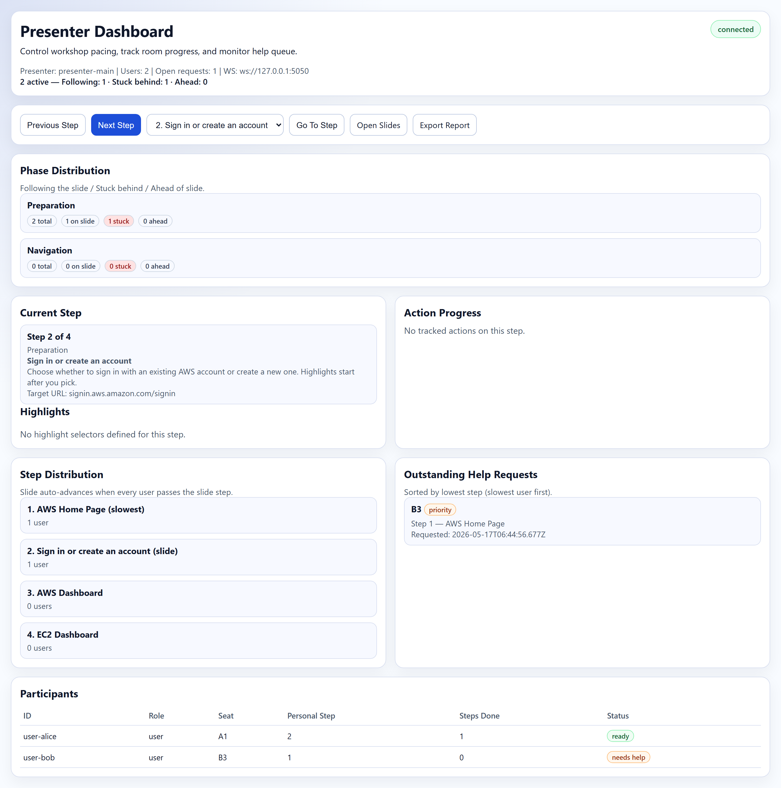
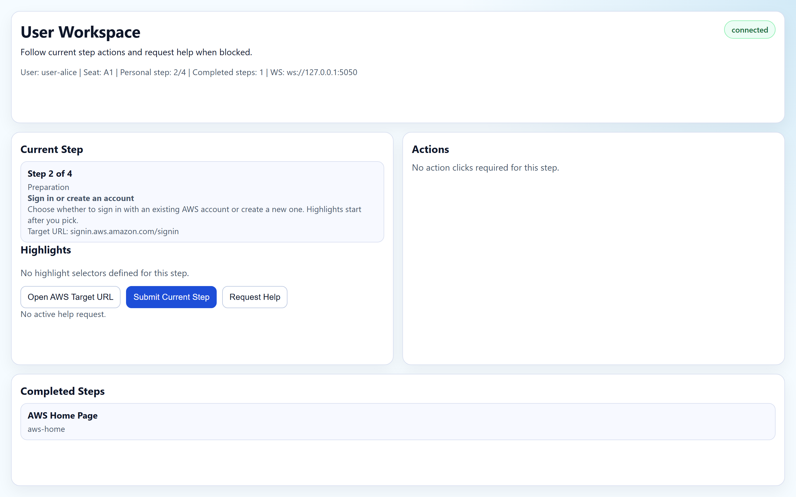
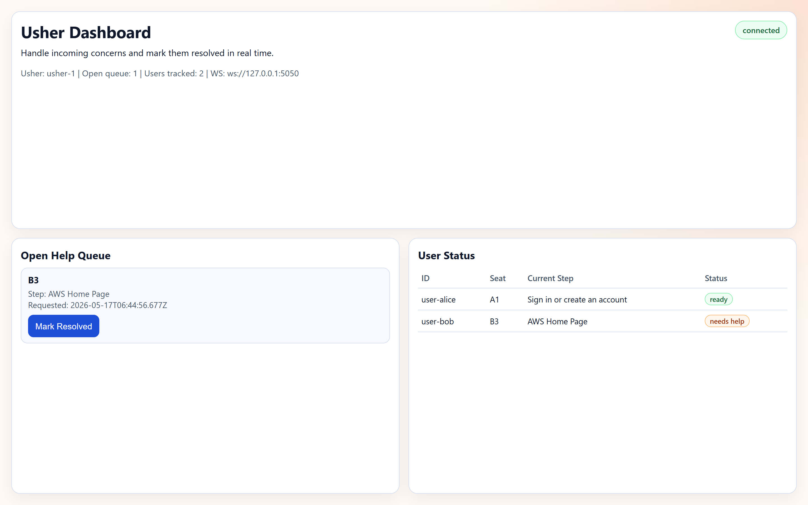

# Getting Started — Legarda Workshop 3

Beginner guide para sa first-time users ng AWS EC2 workshop platform na 'to. Kung dev ka at gusto mo yung architectural details, tingnan mo na lang ang [`README.md`](./README.md).

---

## Ano ba 'to?

Local-first na coordination tool para sa workshop kung saan may **presenter** (yung nagtuturo), **users** (yung mga participants), at **ushers** (yung tumutulong sa stuck na participants). Lahat ng devices nasa same WiFi — walang internet needed para mag-sync.

- **Presenter** controls the pacing (Next Step / Previous Step).
- **Users** automatically follow along — ipapakita sa screen nila yung current step at mag-highlight ng tamang AWS Console buttons via Playwright.
- **Ushers** monitor the help queue — pag may umangat na "Request Help", makikita nila yung seat number at sino ang stuck.

---

## Bago magsimula

Kelangan mo:

- **Node.js 18 or newer** — check via `node --version`.
- **npm** — kasama na 'to sa Node install.
- **Same WiFi network** para sa lahat ng devices (presenter laptop + participant laptops + usher device).
- **Modern browser** — Chrome / Edge / Firefox. Playwright will install its own Chromium for the AWS overlay automation.

Para mahanap yung IP address mo sa Windows:

```powershell
ipconfig
```

Hanapin yung "IPv4 Address" sa active WiFi adapter — yan yung `PRESENTER_IP` na gagamitin sa baba (halimbawa: `192.168.1.42`).

---

## Yung Tatlong Roles

| Role | URL na bubuksan | Anong ginagawa |
|------|----------------|----------------|
| **Presenter** | `http://PRESENTER_IP:5050/presenter` | Step controls, room progress, help queue overview |
| **User** | `http://127.0.0.1:5174/user?id=user-1&seat=A1` | Sumusunod sa step, may "Request Help" button |
| **Usher** | `http://PRESENTER_IP:5050/usher?id=usher-1` | Help queue + sino ang stuck sa anong step |

> Yung **Usher** dashboard walang setup — link lang. Buksan mo lang sa any browser na pwedeng umabot sa presenter IP.

---

## Quick Start (single machine, for testing)

Gusto mo lang subukan kung paano gumagana? Tatlong terminal, isang machine:

```powershell
# 1. Install deps (one-time, per role folder)
cd presenter; npm install; cd ..
cd user;      npm install; cd ..

# 2. Start the presenter server (Terminal 1)
npm run start:presenter
# → "Presenter server listening on http://10.250.250.1:5050"
```

Pag ayaw mag-bind sa `10.250.250.1`, override mo yung host:

```powershell
$env:PRESENTER_HOST = "127.0.0.1"
npm run start:presenter
```

Tapos buksan mo sa browser:

- `http://127.0.0.1:5050/presenter`
- `http://127.0.0.1:5050/user?id=demo&seat=A1`
- `http://127.0.0.1:5050/usher?id=usher-1`

Ito yung mga screen na makikita mo:

### Presenter Dashboard



Dito mo i-cocontrol yung workshop. Yung "Next Step" button ang magpapasulong ng buong room. Sa baba makikita mo lahat ng participants at sino ang need ng tulong.

### User Workspace



Ito ang makikita ng bawat participant. May current step, target AWS URL button, at "Request Help" pag stuck.

### Usher Dashboard



Pag may nag-click ng "Request Help", lalabas siya dito agad with seat number — para alam ng usher kung saang upuan pupunta.

---

## Multi-Device Setup (real workshop)

Eto na yung totoong setup — separate machines per role.

### 1. Sa Presenter Machine

```powershell
cd presenter
npm install
$env:PRESENTER_HOST = "<YOUR_LAN_IP>"   # e.g. 192.168.1.42
npm start
```

Tandaan yung IP — i-share mo sa mga participants at sa usher.

Buksan: `http://<YOUR_LAN_IP>:5050/presenter`

### 2. Sa Bawat Participant Laptop

```powershell
cd user
npm install
npm run setup:playwright            # one-time, installs Chromium for the AWS overlay
$env:PRESENTER_WS = "ws://<PRESENTER_IP>:5050"
npm start
```

Buksan sa browser: `http://127.0.0.1:5174/user?id=user-1&seat=A1`

Palitan yung `id` at `seat` per participant (e.g. `user-2&seat=A2`, `user-3&seat=B1`, ...). Yung seat label ito yung makikita ng usher pag nag-request ng help.

Optional — para sa AWS Console overlay (yung Playwright na may blinking highlights):

```powershell
$env:PRESENTER_WS = "ws://<PRESENTER_IP>:5050"
npm run start:aws-guide
```

### 3. Sa Usher Device

Walang install. Buksan lang sa any browser:

```
http://<PRESENTER_IP>:5050/usher?id=usher-1
```

Pwede kang maglagay ng multiple usher (`usher-2`, `usher-3`, ...) — same URL pero iba yung `id`.

---

## Typical Workshop Flow

1. Pre-workshop: presenter pinapatakbo na yung server. Participants nakapasok na sa user URL nila with seat assigned. Usher bukas na yung dashboard.
2. Presenter clicks **Next Step** → lahat ng users auto-advance sa next step simultaneously. Yung AWS Console nila (kung naka-`start:aws-guide`) automatic mag-highlight ng tamang button.
3. Participant na stuck → click "Request Help" sa kanilang user panel.
4. Usher's dashboard agad nagpapakita ng seat number at kung anong step yung stuck — pumupunta sila sa upuan na yun.
5. Pag resolved, usher clicks "Mark Resolved" → mawawala sa queue, ma-log para sa post-workshop report.
6. After workshop, presenter clicks **Export Report** → makakakuha ka ng `report.txt` na may completion stats per participant.

---

## Troubleshooting

**"Cannot connect to WS" sa user panel.**
Make sure yung `PRESENTER_WS` env var ay tama at kapareho yung IP ng `ipconfig` ng presenter. Same WiFi ba kayo? Firewall blocking port 5050?

**"EADDRINUSE: port 5050 already in use".**
May ibang process na hawak yung port. Sa Windows, patayin sa Task Manager o:

```powershell
Get-NetTCPConnection -LocalPort 5050 | Select-Object OwningProcess
Stop-Process -Id <process_id> -Force
```

**Playwright session lock error sa user side.**
Existing reset script na para dito — patakbuhin mo lang:

```powershell
.\start.ps1
```

Mag-kikill yung lahat ng related node processes, lilinis ng `user/.aws-session/SingletonLock`, at i-restart yung services with auto-detected LAN IP.

**Gusto kong i-regenerate yung screenshots sa docs.**

```powershell
npm run screenshots
```

Magti-trigger yung `scripts/capture-screenshots.mjs` na magbubukas ng presenter server, mag-seed ng fake participants, at gagawa ng bagong PNGs sa `docs/screenshots/`.

---

## Para sa Devs

Kung gusto mo malaman yung architecture, WebSocket protocol, module structure, at ibang technical na bagay — sa [`README.md`](./README.md) na lahat 'yon. Yung beginner guide na 'to focused sa pag-launch at pag-gamit lang.
