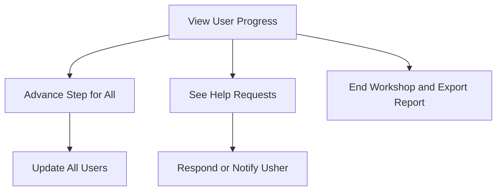

# Presenter Dashboard

The Dashboard is the presenter's command center. Here, the presenter can see everyone's progress, move the workshop forward, and respond to the needs of the group.

## Story
The presenter glances at the dashboard and sees a sea of progress bars—some green, some waiting. When everyone is complete with the current step, a pop-out notification appears, letting the presenter know the group is ready to move on. Steps are based on a predetermined plan for the workshop, so the presenter can focus on guiding rather than improvising. If a help request pops up, it's easy to spot and address. At the end, the dashboard offers a summary of how the workshop went.

## Main Flow (Mermaid)

## Key Responsibilities
- Show real-time progress for all users
- Allow the presenter to advance steps
- Display and manage help requests
- Summarize the workshop for review
- Show per-form EC2 progress counts during multi-part flows such as `Launch instances`, so the presenter can see how many users have completed each form section in real time

---

*The Dashboard is the presenter's window into the workshop, always clear and actionable.*
