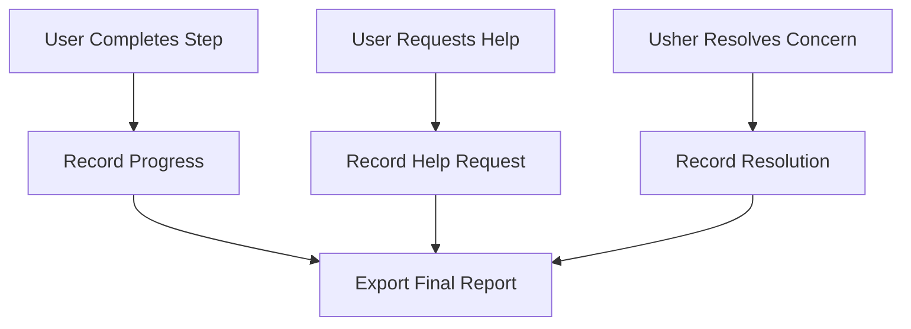

# Progress Tracker (Presenter)

The Progress Tracker is the presenter's memory. It keeps track of every user's journey, every help request, and every resolution, so nothing is forgotten.

## Story
As the workshop unfolds, the Progress Tracker quietly notes each step completed, each hand raised, and each concern resolved. At the end, it weaves these moments into a report, telling the story of the group's learning.

## Main Flow (Mermaid)

## Key Responsibilities
- Track each user's progress
- Log help requests and resolutions
- Generate a final report for review
- Track completion at the form-section level for EC2 workflows, such as how many users have completed instance details, AMI selection, instance type, key pair, network settings, and launch review

---

*The Progress Tracker is the silent historian, capturing every important moment of the workshop.*
