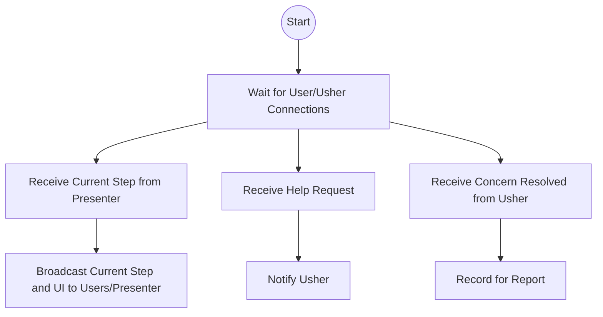

# Presenter Server

The Presenter Server is the conductor of the workshop orchestra. It keeps everyone in sync, making sure no one is left behind and every step is clear.

## Story
The presenter starts the server, and participants begin to connect. For each step, the server sends out instructions about which UI elements need to blink or be highlighted—this is visible to both the user and the presenter, so everyone knows what to do. As the presenter advances through the workshop, the server guides each user to the next step. If someone asks for help, the server notes it and lets the usher know. When an usher resolves a concern, the server records it for the final report.

When everyone connected is complete with the current step, the Playwright instance on the presenter side automatically clicks to advance to the next step. Steps are based on a predetermined plan for the workshop, so the presenter can focus on guiding rather than improvising. 

## Main Flow (Mermaid)

## Key Responsibilities
- Accept connections from users and ushers
- Broadcast the current step and UI elements to blink/highlight to all users and the presenter
- Relay help requests to ushers
- Record when concerns are resolved for post-workshop analysis
- Automatically advance the presenter's Playwright when all users are complete
- Support step creation based on a predetermined plan and future AI agent tracking

---

*The Presenter Server is the steady hand, guiding the workshop and keeping everyone together.*