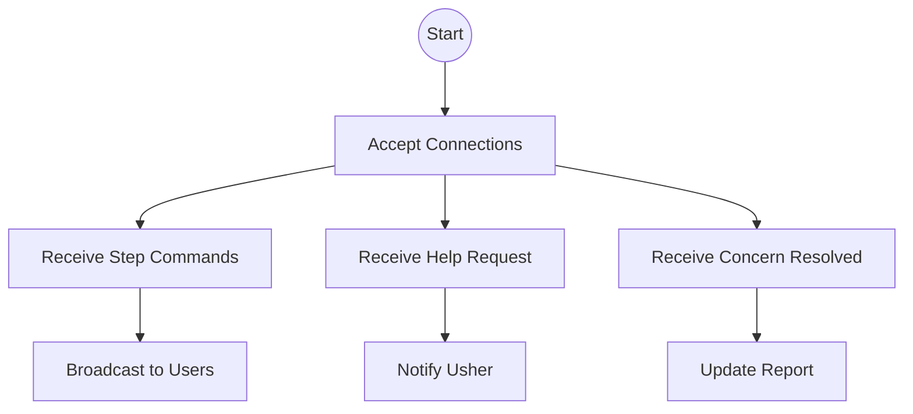

# WebSocket (Presenter)

The WebSocket is the presenter's megaphone and inbox. It lets the presenter speak to all users at once and listen for their needs.

## Story
When the server starts, it opens its ears to the network. Users and ushers connect, and the WebSocket keeps the conversation flowing—steps, help requests, and resolutions all travel this path.

## Main Flow (Mermaid)

## Key Responsibilities
- Manage all real-time communication
- Ensure every message reaches its destination
- Keep the workshop running smoothly

---

*The WebSocket is the presenter's voice and ears, always open, always listening.*