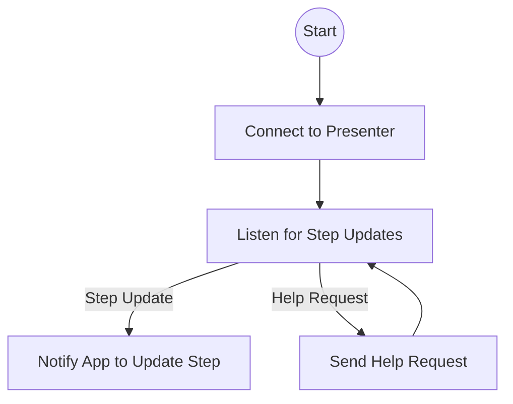

# WebSocket (User Backend)

The WebSocket connection is the user's invisible thread to the presenter. It keeps the participant in sync with the workshop, ensuring everyone moves together.

## Story
As soon as the user app starts, it quietly reaches out to the presenter, asking, "What step are we on?" Throughout the workshop, it listens for updates, always ready to move the user forward or send a help request if needed.

## Main Flow (Mermaid)

## Key Responsibilities
- Maintain a live connection to the presenter
- Receive step updates and relay them to the app
- Send help requests when the user needs assistance

---

*The WebSocket is the silent partner, always keeping the user in step with the group.*