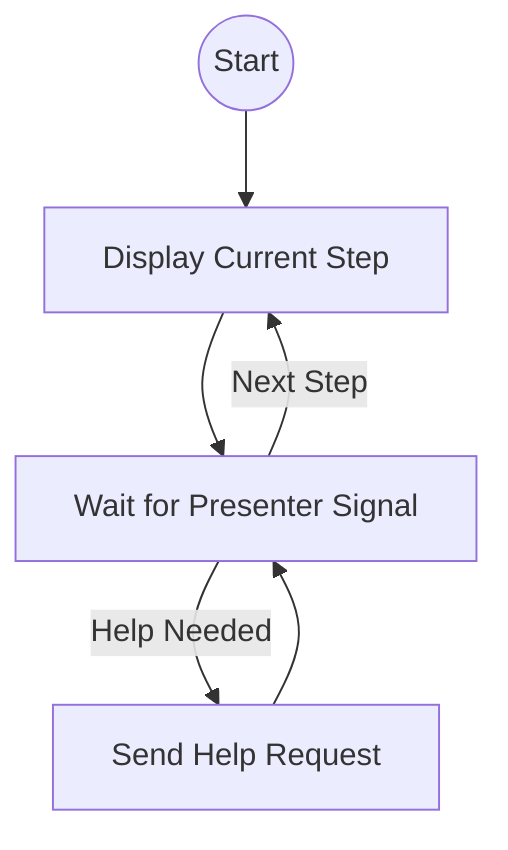

# App (User Frontend)

The App is the heart of the user's journey. When a participant opens the application, they're greeted by a friendly interface that guides them through each step of the EC2 workshop. The App listens for signals from the presenter, updating the current step in real time, and provides a clear path forward.

## Story
Imagine a participant, laptop open, ready to learn. The App welcomes them, showing the first step. As the presenter advances, the App gently nudges the participant to the next task. If the participant needs help, a big, visible button is always there to call for assistance.

## Main Flow (Mermaid)

## Key Responsibilities
- Display the current workshop step
- Listen for presenter updates
- Allow the user to request help
- Keep the experience smooth and reassuring

---

*The App is the user's guide, always present, always ready to help or move forward.*