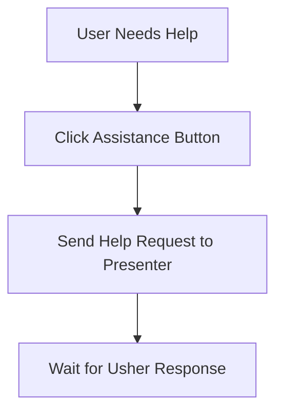

# AssistanceButton Component

The AssistanceButton is the user's lifeline. Whenever a participant feels stuck, this button is their way to call for help—no embarrassment, just support.

## Story
The button is always visible, never hidden. When clicked, it sends a gentle signal to the usher, letting them know someone needs a hand. The participant can relax, knowing help is on the way.

## Main Flow (Mermaid)

## Key Responsibilities
- Always available for the user
- Sends help requests instantly
- Reassures the participant that support is close by

---

*The AssistanceButton is the user's safety net, always ready to connect them to help.*