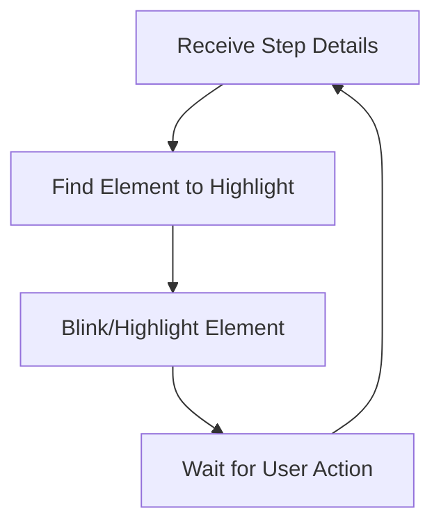

# Overlay Component

The Overlay is like a spotlight operator in a theater. Its job is to highlight the most important part of the AWS Console, making sure the participant knows exactly where to look or click next.

## Story
When a new step arrives, the Overlay gently blinks or highlights the relevant button or section. It's never intrusive—just a helpful nudge, saying, "Hey, this is where your attention should be now."

## Main Flow (Mermaid)

## Key Responsibilities
- Visually highlight the current focus area
- Respond to new steps from the presenter
- Make the user's path clear and stress-free

---

*The Overlay is the gentle guide, never letting the user feel lost in the AWS Console.*