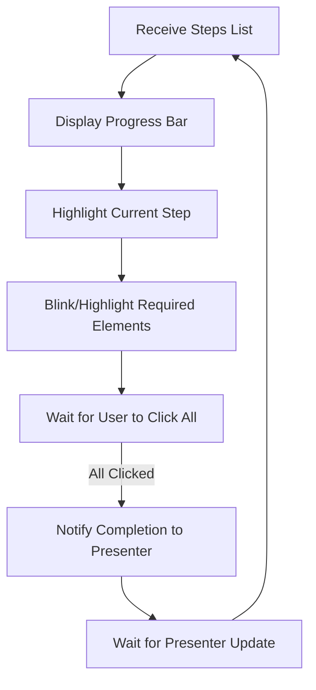

# StepNavigator Component

The StepNavigator is the user's map. It shows where they are in the journey and what lies ahead. Each step is a milestone, and the navigator celebrates progress.

## Story
As the participant completes each task, the StepNavigator marks it as done. The current step is always clear, and the next one is visible, so there's no confusion about what's next. To move forward, the user must click all the blinking buttons or highlighted parts of the AWS website for the current step—this ensures they truly engage with each part of the process.

## Main Flow (Mermaid)

## Key Responsibilities
- Show all steps and current position
- Update as the presenter advances
- Motivate the user with visible progress

---

*The StepNavigator is the user's progress cheerleader, always celebrating each achievement.*