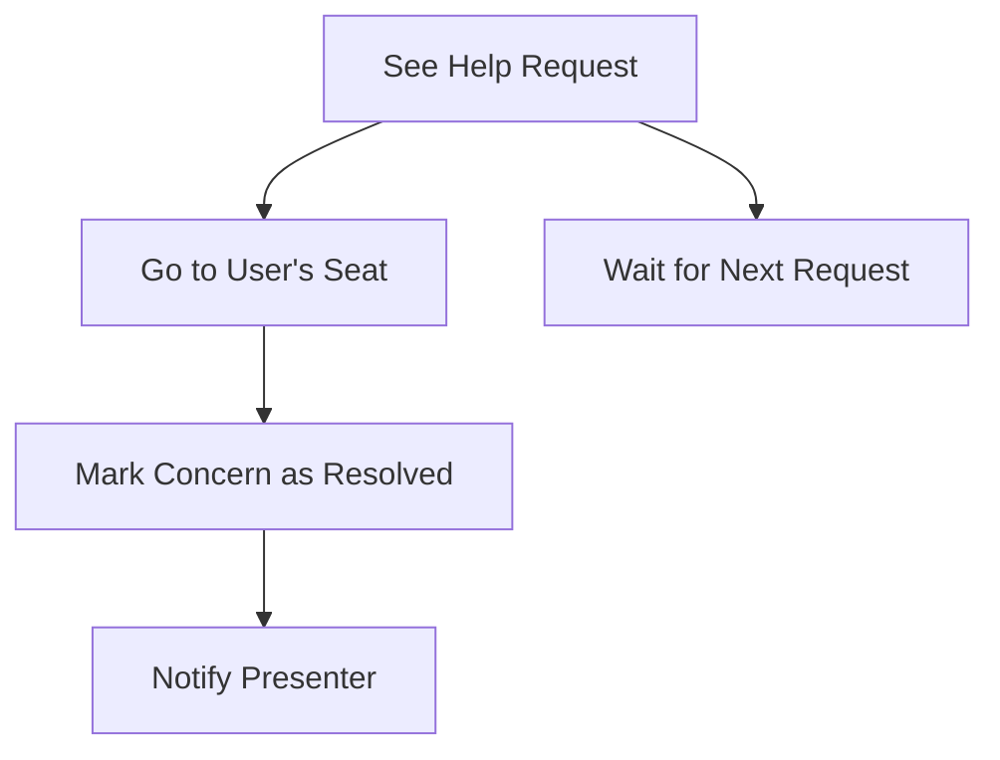

# Usher Dashboard

The Usher Dashboard is the usher's radar. It shows who needs help, where they are, and what step they're on, so no one is left waiting.

## Story
The usher watches the dashboard, ready to spring into action. When a help request appears, the usher sees the seat number and the step. After helping, the usher marks the concern as resolved, sending a quiet signal back to the presenter for the final report.

## Main Flow (Mermaid)

## Key Responsibilities
- Display all outstanding help requests
- Show seat numbers and steps for each request
- Allow usher to mark concerns as resolved
- Notify presenter for post-workshop analysis

---

*The Usher Dashboard is the usher's guide, making sure every participant gets the help they need, when they need it.*