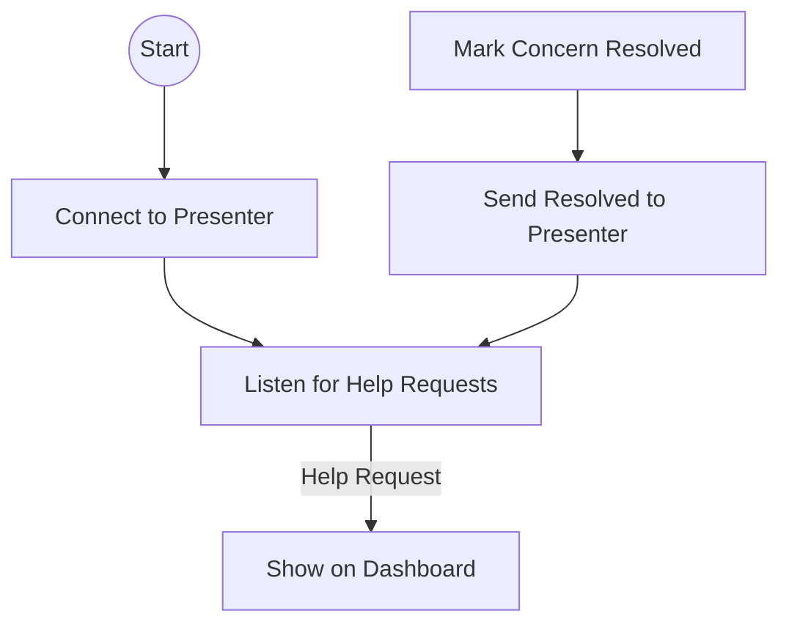

# WebSocket (Usher)

The WebSocket is the usher's hotline to the presenter. It delivers every help request and lets the usher report when a concern is resolved.

## Story
As soon as the usher dashboard opens, it connects to the presenter. Every time a participant asks for help, the usher sees it instantly. When the usher helps someone, a single click marks the concern as resolved, and the presenter is updated.

## Main Flow (Mermaid)

## Key Responsibilities
- Connect to the presenter server
- Receive and display help requests
- Send concern resolved signals

---

*The WebSocket is the usher's instant messenger, always delivering the right message at the right time.*